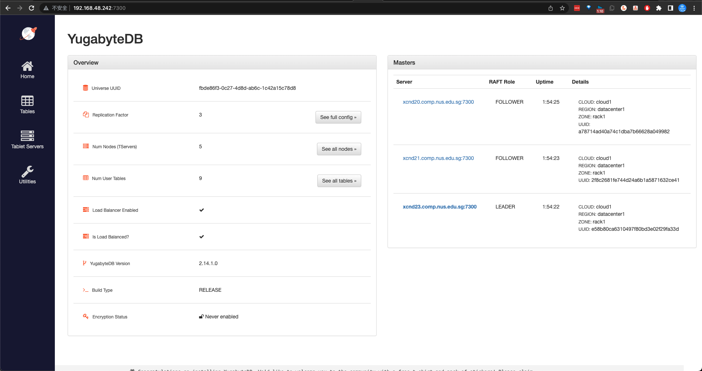
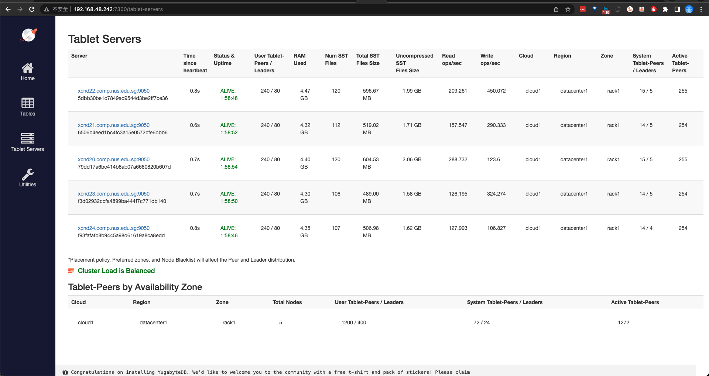
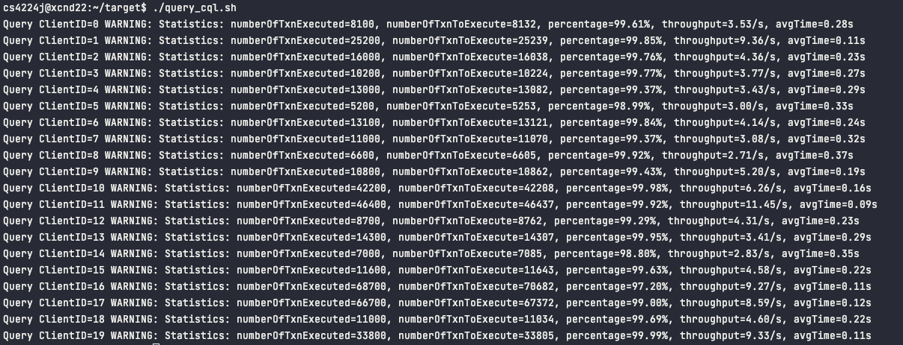
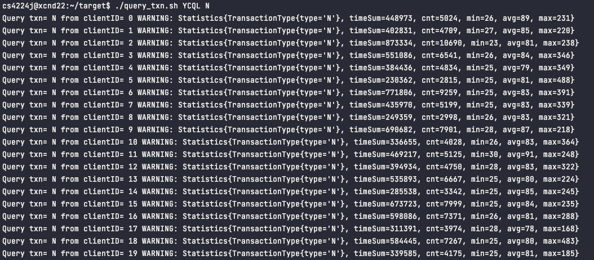
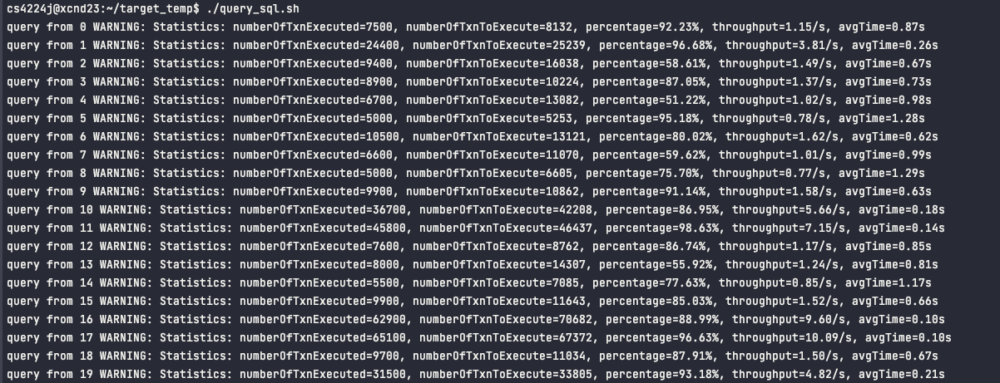
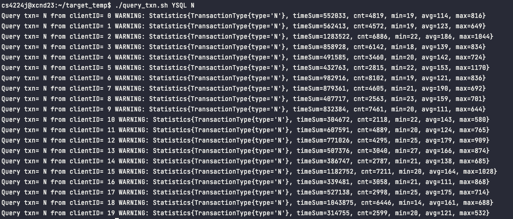

# Distributed Database Project (Group-J)

## 0. Connect to NUS SOC VPN

In order to visit NUS SOC intranet, connecting to SOC VPN is required.

To setup, consider this [SOC VPN Setup Guide](https://dochub.comp.nus.edu.sg/cf/guides/network/vpn)

## 1. SSH Public Key Authentication to 5 Servers

As required, we use `ssh` to access the 5 SoC servers. To avoid entering password repeatedly when simultaniously sending instructions to servers every time, please configure the **SSH public key authentication** to the 5 servers using the following steps.

To obtain ssh connection to 5 servers, on your **local machine**, enter `~/.ssh`:

```bash
# build a new encryption key pair
cd ~/.ssh && ssh-keygen
# keep typing 'enter' until the key pair is generated
```

Given user `cs4224j`'s password `xxxx`, now copy the generated ssh public key into each server by the below command and repeat this command **for xcnd21 to xcnd 24**.

```bash
ssh-copy-id cs4224j@xcnd20.comp.nus.edu.sg
# and type 'yes' or the user password `xxxx` when see according messages
```

Now you wil not enter password repeatedly when use ssh to connect any server.

Note: **~** in **any xcndXX servers**, referring to `/home/stuproj/cs4224j` will frequently be use as our **default user path** in below sections.

## 2. Setup Files(at the cluster already)

- The data and xact raw files are already located in `~/project_data/data_files`(including our modified data) and `~/project_data/xact_files`.
- The database initialization files, in <u>.sql</u> and <u>.cql</u> are already located in `~/db_init_csql_SoCluster`.

### Install YugabyteDB

- The yugabyteDB setup is already installed in `~/yugabyte-2.14.1.0`.
  - To install from the scratch, its original installer file, _yugabyte-2.14.1.0-b36-linux-x86_64.tar.gz_ is at ~ which can be decompressed and installed into the final software`.

```bash
# Download the YugabyteDB binary package and decompress
tar xvfz yugabyte-2.14.1.0-b36-linux-x86_64.tar.gz && cd yugabyte-2.14.1.0/

# Configure by post installation
./bin/post_install.sh
```

## 3. Cluster-initialization(in this repo)

### Cluster-initialization scripts

There are several cluster-related <u>bash scripts</u> for different use cases located **in our repositoy** in one of cluster deployment file paths `gj2-ram/` ("gj2-ram" means this cluster is _group j_'s 2nd cluster using non-default ports deployed at ` /mnt/ramdisk/`). First you should change directory into the script path by `cd gj2-ram`:

- The 5-server yugabyte cluster, with full SQL/CQL databases, can be newly built from scratch with below steps separately:

  1. To build and start a cluster, then run `./start_cluster_gj2.sh`. For the status check, go as mentioned just above.

     

  2. If some server fails to start a ybmaster/tserver process, you have to start it at the node(s) **manually**:

     ```bash
     # On xcnd20.comp.nus.edu.sg
     ssh cs4224j@xcnd20.comp.nus.edu.sg
     # and/or start a ybmaster
     cd ~/yugabyte-2.14.1.0/bin && ./yb-master --flagfile 2ms20.conf >& /mnt/ramdisk/gj2/disk1/yb-master.out &
     # and/or start a tserver
     cd ~/yugabyte-2.14.1.0/bin && ./yb-tserver --flagfile 2ts20.conf >& /mnt/ramdisk/gj2/disk1/yb-tserver.out &
     
     # On xcnd21.comp.nus.edu.sg
     ssh cs4224j@xcnd21.comp.nus.edu.sg
     # and/or start a ybmaster
     cd ~/yugabyte-2.14.1.0/bin && ./yb-master --flagfile 2ms21.conf >& /mnt/ramdisk/gj2/disk1/yb-master.out &
     # and/or start a tserver
     cd ~/yugabyte-2.14.1.0/bin && ./yb-tserver --flagfile 2ts21.conf >& /mnt/ramdisk/gj2/disk1/yb-tserver.out &
     
     # On xcnd22.comp.nus.edu.sg
     ssh cs4224j@xcnd22.comp.nus.edu.sg
     # and/or start a ybmaster
     cd ~/yugabyte-2.14.1.0/bin && ./yb-master --flagfile 2ms22.conf >& /mnt/ramdisk/gj2/disk1/yb-master.out &
     # and/or start a tserver
     cd ~/yugabyte-2.14.1.0/bin && ./yb-tserver --flagfile 2ts22.conf >& /mnt/ramdisk/gj2/disk1/yb-tserver.out &
     
     # On xcnd23.comp.nus.edu.sg
     ssh cs4224j@xcnd23.comp.nus.edu.sg
     # and/or start a ybmaster
     cd ~/yugabyte-2.14.1.0/bin && ./yb-master --flagfile 2ms23.conf >& /mnt/ramdisk/gj2/disk1/yb-master.out &
     # and/or start a tserver
     cd ~/yugabyte-2.14.1.0/bin && ./yb-tserver --flagfile 2ts23.conf >& /mnt/ramdisk/gj2/disk1/yb-tserver.out &
     
     ssh cs4224j@xcnd24.comp.nus.edu.sg
     # and/or start a ybmaster
     cd ~/yugabyte-2.14.1.0/bin && ./yb-master --flagfile 2ms24.conf >& /mnt/ramdisk/gj2/disk1/yb-master.out &
     # and/or start a tserver
     cd ~/yugabyte-2.14.1.0/bin && ./yb-tserver --flagfile 2ts24.conf >& /mnt/ramdisk/gj2/disk1/yb-tserver.out &
     ```

  3. If the cluster has already started with at least 3 master servers and **at least 3 tservers** (go into the **Tablet Servers** on the left to see how many tservers are alive as below),

     

     then you can then build database by `./initcql_gj2.sh` for a YCQL database and `./initsql_gj2.sh` for a YSQL database. The console will show processes of importing each table/keyspace like below.

- When to the end of usage, to terminate the cluster, try `./end_cluster_gj2.sh`.

- To delete a cluster completely by removing all the cluster-related files, try `./rm_files_gj2.sh`.

## 4. Project Files(in this repo)

### 1. Java Program

We have several components for the whole programe at path `src/main/java`.

| Class Object        | Purpose                                                                                                                                                                                                                                                 |
| ------------------- | ------------------------------------------------------------------------------------------------------------------------------------------------------------------------------------------------------------------------------------------------------- |
| SampleApp.java      | Entry point is Main method. This is the main thread, then 4 worker thread will be launched to execute transactions.                                                                                                                                     |
| Statistics.java     | Record metrics for each of 8 transactions, such as total executing time, max, min, and average time for executed transactions.                                                                                                                          |
| ExecuteManager.java | Responsible for executing transactions for both YSQL and YCQL, and reporting statistic metrics.                                                                                                                                                         |
| DBState.java        | Responsible for querying database state only.                                                                                                                                                                                                           |
| DataSource.java     | Responsible for connecting to YSQL or YCQL database using corresponding `JDBC` driver.                                                                                                                                                                  |
| Transaction.java    | A template abstract class for transactions. It defines a template method for all transactions. This is the usage of `Template Method` design patterns, see more in [Template Method Toturial](https://refactoring.guru/design-patterns/template-method) |
| transactionImpl     | Implementations for each transaction types for both YSQL and YCQL.                                                                                                                                                                                      |

### 2. Configuration file

Our configuration files are located at `src/main/resources`.

| Directory Name                | Purpose                                                                                                  |
| ----------------------------- | -------------------------------------------------------------------------------------------------------- |
| src/main/resources/scripts    | Useful `bash` scripts, such as to launch or end `20` clients, to query server load and server ram usage. |
| src/main/resources/xact_files | Transactions raw files that clients will read and execute.                                               |

## 5. Instructions on running experiments

In our project, we prioritise the code design to allow easy use. **Both `YSQL` and `YCQL` use the same `.jar` file.**

TODO: 修改端口和 IP

To run the clients, do the following:

### 0) Make sure step 2 and 3 finished properly

### 1) Compile Java file to `.jar`

At the `root directory` of this `repo`, execute:

```zsh
$ mvn clean package
```

### 2) Send local `.jar` file onto `SOC` servers

The directory that stores all our `.jar, logs` is `~/target`.

```bash
$ scp ./target/yugabyte-simple-java-app-1.0-SNAPSHOT.jar cs4224j@192.168.48.239:~/target
```

### 3) Start clients

#### YCQL

##### a) start clients

```bash
$ ./src/main/resources/scripts/start_client_cql.sh
```

##### b) check logs on any SOC server

```bash
# log on SOC server
$ ssh cs4224j@xcnd22
$ cd ~/target
# check number of logs, expect to be 25
$ ls YCQL-log-*.txt | wc -l
```

##### c) Query overall executing status

```bash
$ ./query_cql.sh
```

Sample Output



##### d) Query the speed of a specific transaction type

```bash
$ ./query_txn.sh YCQL N
$ ./query_txn.sh YCQL D
$ ./query_txn.sh YCQL P
$ ./query_txn.sh YCQL I
```



##### e）Log files

Query clients:

```bash
$ ./query_clients_cql.sh
```

Query throughput:

```bash
$ ./query_throughput_cql.sh

```

Query DB state:

```bash
$ cat CQL_dbstate.csv
```

#### YSQL

##### a) start clients

```bash
$ ./src/main/resources/scripts/start_client_sql.sh
```

##### b) check logs on any SOC server

```bash
# log on SOC server
$ ssh cs4224j@xcnd22
$ cd ~/target
# check number of logs, expect to be 25
$ ls YSQL-log-*.txt | wc -l
```

##### c) Query overall executing status

```bash
$ ./query_sql.sh
```

Sample Output



##### d) Query the speed of a specific transaction type

```bash
$ ./query_txn.sh YSQL N
$ ./query_txn.sh YSQL D
$ ./query_txn.sh YSQL P
$ ./query_txn.sh YSQL I
$ ./query_txn.sh YSQL O
$ ./query_txn.sh YSQL R
$ ./query_txn.sh YSQL S
$ ./query_txn.sh YSQL T
```



##### e）Log files

Query clients:

```bash
$ ./query_clients_sql.sh
```

Query throughput:

```bash
$ ./query_throughput_sql.sh

```

Query DB state:

```bash
$ cat SQL_dbstate.csv
```

### 4) Abort clients

At `root diretory` of repo on your local machine:

```bash
$ ./src/main/resources/scripts/end_client.sh
```

## 6. Cluster Clean-up

- When to the end of usage, to terminate the cluster, try `./end_cluster_gj2.sh`.

- To delete a cluster completely by removing all the cluster-related files, try `./rm_files_gj2.sh`.
